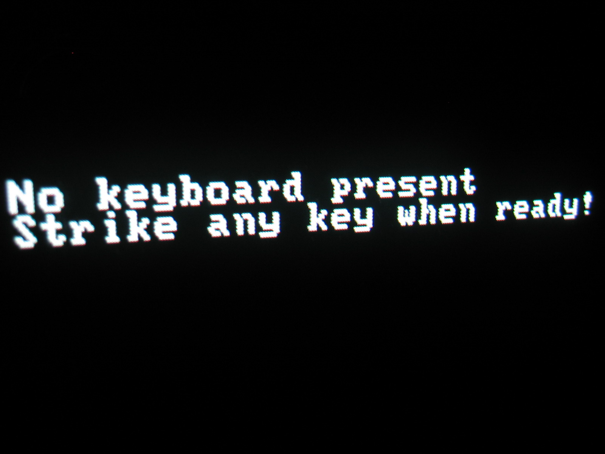

# Thomas's Ice Breaker

## Who am I?

A human trying to know himself and this sad world!

## What am I doing at HYF?

Well, I'm learning code to improve my skills and get a job.

### What a classic code!
```
<h4>Hello world and the answer of the world!</h4>
<h5>The learners are all happy to write their first tag with <h6>Hello world !</h6></h5>

<h5>But why is it that as soon as people learn how to make web pages, they spend their time saying hello to me?</h5>

```

## What do I do :hourglass: when I'm not learning?

When I'm not learning I play video games (Call Of Duty for example). I read... sometimes books about programming, Artificial Intelligence or biographies. These last ones allow to discover that even eminent personalities had a lot of setbacks in their life before being recognized... or not!

## Dear bug :camera:


